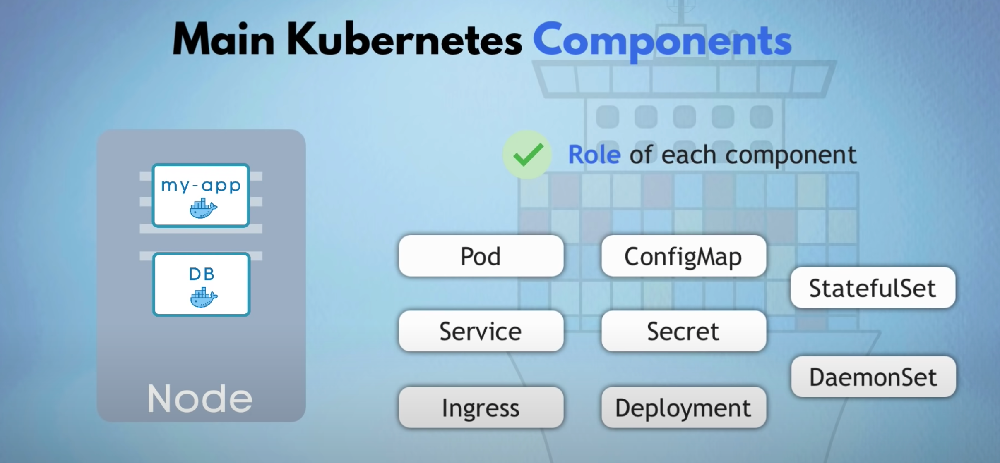
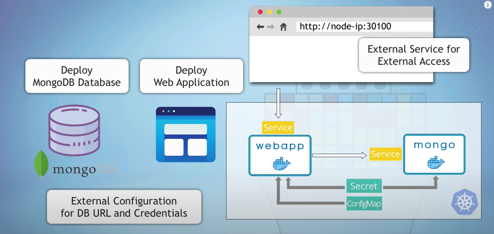

# 快速熟悉


## 基础组件
### Node
物理机 / 虚拟机抽象。

### Pod
可以看做 docker 中的 container 抽象。

每个 pod 都有自己的 ip，但是一般 pod 间的通信不直接用 pod 的 ip，因为 pod 的生命可能很短暂，在 k8s 中，pod 的存活对于服务没有影响，如果 node 的资源不足就会干掉 node 上的一些 pod，并把这些 pod 转移到资源充足的 node 上，新的 pod 起来之后，ip 和之前不一定一样。

所以 k8s 提供了另一个 component：`service`。

### Service
- 可以提供固定的静态 ip

### Ingress
提供给外部能访问服务的能力。

### ConfigMap & Secret
ConfigMap 是一个配置文件，这样一些配置修改之后不用重新打包 image，而对于一些密码或者敏感配置，可以通过 `Secret` 这个组件加密管理。

Secret 里面存储的是加密过的 base64 字符串。

### Volume
k8s 本身不提供文件存储能力，通过 volume 来实现。

### Deployment
通过前面几个组件，已经能基本实现一个提供给外部访问的服务了。但是如果我们升级了 image，发布的时候需要下掉老的 pod，上线新的 pod，或者某些情况下我们的 pod 直接挂了，这时候我们的整个服务就会挂掉。

通过复制一个一样的 pod，这样在一个 pod 挂掉的时候，还能有一个存活提供服务。

`Deployment` 能够帮助我们方便地对 pod 进行扩缩容。
`Deployment` 可以看做是 pod 的上层，对 pod 的抽象。

### SATEFULSET
对于一些有状态的 pod，不能直接使用 Deployment 进行扩容，k8s 提供了 stateful 组件来对这种有状态服务进行扩缩容。

## yaml 配置
最后会把这个配置发送给 `api server` ，有 api server 分发到最后的 node。

k8s 是声明式指令，yaml 中配置的是系统最终要达到的状态，k8s 会一直监控系统当前状态是否达到需求，如果没有会慢慢调整系统到指定状态。

### yaml 组成
第一行指明当前的 api 版本，第二行表明当前声明的什么类型。
```yaml
apiVersion: apps/v1
kind: Deployment
```

#### metadata

#### specification
这里的配置必须得符合 `kind` 声明的类型才能生效。

#### status
这是 k8s 自动生成的，它会比较当前的 status 是否达到了 specification 里面声明的 status，k8s 会自动算出两者的 diff，并将系统“修复”到想要达到的 status。

这份配置保存在 etcd 中。集群的数据都存在这里。

## demo

- mogodb 数据库
- 有个 webapp 会连接到这个数据库
- 会有一些配置用到 ConfigMap 和 Secret
- 最后能在浏览器访问到

要完成上面的这些，会用到 4 份 yaml 配置：
- ConfigMap
- Secret
- Deployment
- Service

先来看看 MongoDB 的 config yaml 的配置：
```yaml
apiVersion: v1
kind: ConfigMap
metadata:
	name: mongo-config
data:  # 需要配置的键值对就放在 data 里面
	mongo-url: mongo-service  # 这是后面会建的 service
```

接下来看 mongo-sercet 的 yaml 配置：
```yaml
apiVersion: v1
kind: Secret
metadata:
	name: mongo-secret
type: Opaque  # 常用的一种定义加密键值对的类型
data:
	mongo-user: YWRtaW4=  # admin
	mongo-password: MTIzNDU2  # 123456
```

最后是 MongoDB 的 Deployment 和 Service yaml，一般可以把这两个配置放在一个 yaml 文件里面：
```yaml
apiVersion: v1
kind: Deployment
metadata:
	name: mongo-deployment
```
这是一个 yaml 基本的部分，Deployment 的 yaml 中有个专用的 specification 块，spec 块里的 template 块就是用来配置 pod 的。

`spec.template` 有自己的 `metadata` 和 `spec`，`spec.template.spec` 配置的就是 container，所以对于一个简单的 MongoDB 可以这么配置：
```yaml
spec:
	template:
		spec:
			containers:
			- name: mongodb
			  image: mongo:5.0
			  ports:
			  - containerPort: 27017
```

在 k8s 中，可以给任意的 component 一个 labels 键值对，`labels` 顾名思义是用来对这些资源打标签的，后面可以根据这些标签来“匹配”到这些资源，所以基本每种资源的 `metadata` 里面都最好定义自己的 `labels`。

前面说了，Deployment 可以很方便的建立一堆 pod 副本，但是怎么知道哪些 pod 属于哪个 Deployment 呢？这就是 `spec.selector.matchLabels` 这一块配置干的事，这里面定义的就是当前 Deployment 管理能和这些 labels 匹配上的 pods：
```yaml
spec:
	selector:
		matchLabels:
			appName: mongo
```
这里我定义了一对键值对：`appName: mongo`，那么我就要在 `metadata.labels` 和 `spec.template.metadata.labels` 里也要打上这个键值对，这样这个 Deployment 才能找到这些 pod 并管理他们。
```yaml
apiVersion: v1
kind: Deployment
metadata:
	name: mongo-deployment
	labels:
		appName: mongo
spec:
	replicas: 1  # 这个就是定义当前 Deployment 要创建几个 pod 副本
	selector:
		matchLabels:
			appName: mongo
	template:
		metadata:
			labels:
				appName: mongo
		spec:
			containers:
			- name: mongodb
			  image: mongo:5.0
			  ports:
			  - containerPort: 27017
```

