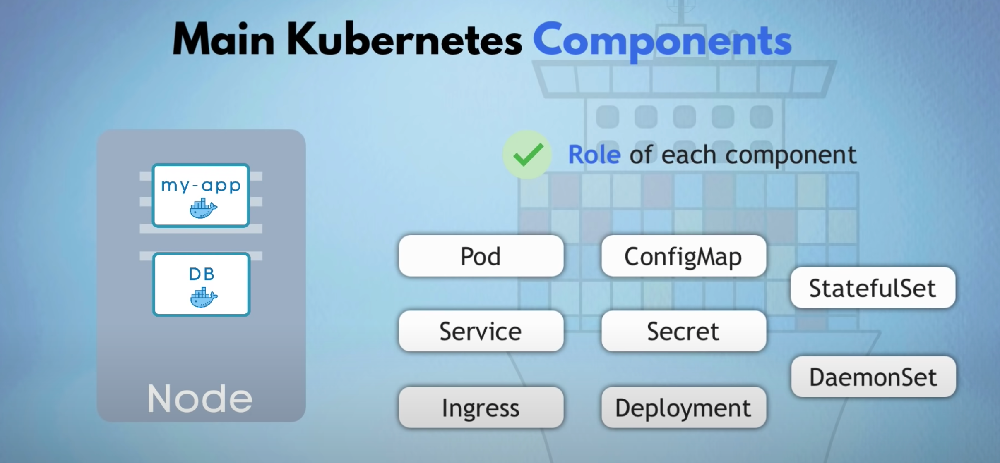
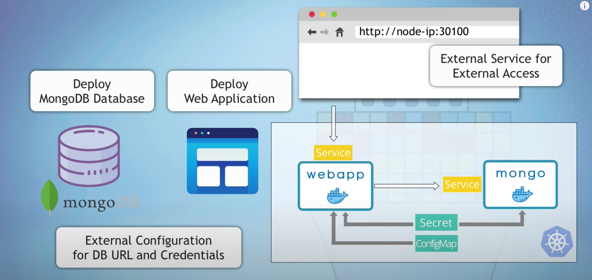
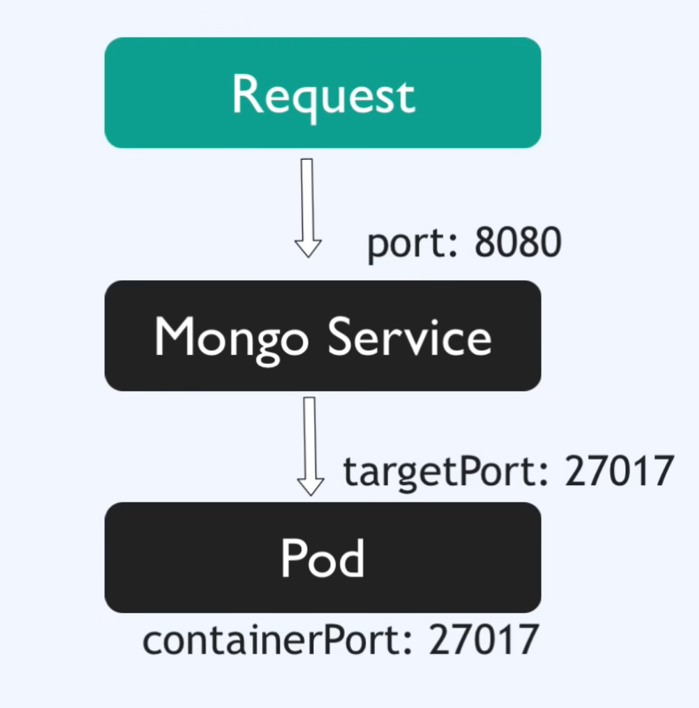

# 快速熟悉


## 基础组件
### Node
物理机 / 虚拟机抽象。

### Pod
可以看做 docker 中的 container 抽象。

每个 pod 都有自己的 ip，但是一般 pod 间的通信不直接用 pod 的 ip，因为 pod 的生命可能很短暂，在 k8s 中，pod 的存活对于服务没有影响，如果 node 的资源不足就会干掉 node 上的一些 pod，并把这些 pod 转移到资源充足的 node 上，新的 pod 起来之后，ip 和之前不一定一样。

所以 k8s 提供了另一个 component：`service`。

### Service
- 可以提供固定的静态 ip

### Ingress
提供给外部能访问服务的能力。

### ConfigMap & Secret
ConfigMap 是一个配置文件，这样一些配置修改之后不用重新打包 image，而对于一些密码或者敏感配置，可以通过 `Secret` 这个组件加密管理。

Secret 里面存储的是加密过的 base64 字符串。

### Volume
k8s 本身不提供文件存储能力，通过 volume 来实现。

### Deployment
通过前面几个组件，已经能基本实现一个提供给外部访问的服务了。但是如果我们升级了 image，发布的时候需要下掉老的 pod，上线新的 pod，或者某些情况下我们的 pod 直接挂了，这时候我们的整个服务就会挂掉。

通过复制一个一样的 pod，这样在一个 pod 挂掉的时候，还能有一个存活提供服务。

`Deployment` 能够帮助我们方便地对 pod 进行扩缩容。
`Deployment` 可以看做是 pod 的上层，对 pod 的抽象。

### SATEFULSET
对于一些有状态的 pod，不能直接使用 Deployment 进行扩容，k8s 提供了 stateful 组件来对这种有状态服务进行扩缩容。

## yaml 配置
最后会把这个配置发送给 `api server` ，有 api server 分发到最后的 node。

k8s 是声明式指令，yaml 中配置的是系统最终要达到的状态，k8s 会一直监控系统当前状态是否达到需求，如果没有会慢慢调整系统到指定状态。

### yaml 组成
第一行指明当前的 api 版本，第二行表明当前声明的什么类型。
```yaml
apiVersion: apps/v1
kind: Deployment
```

#### metadata

#### specification
这里的配置必须得符合 `kind` 声明的类型才能生效。

#### status
这是 k8s 自动生成的，它会比较当前的 status 是否达到了 specification 里面声明的 status，k8s 会自动算出两者的 diff，并将系统“修复”到想要达到的 status。

这份配置保存在 etcd 中。集群的数据都存在这里。

## demo

- mogodb 数据库
- 有个 webapp 会连接到这个数据库
- 会有一些配置用到 ConfigMap 和 Secret
- 最后能在浏览器访问到

要完成上面的这些，会用到 4 份 yaml 配置：
- ConfigMap
- Secret
- Deployment
- Service

先来看看 MongoDB 的 config yaml 的配置：
```yaml
apiVersion: v1
kind: ConfigMap
metadata:
  name: mongo-config
data: # 需要配置的键值对就放在 data 里面
  mongo-url: mongo-service  # 这是后面会建的 service
```

接下来看 mongo-sercet 的 yaml 配置：
```yaml
apiVersion: v1
kind: Secret
metadata:
  name: mongo-secret
type: Opaque  # 常用的一种定义加密键值对的类型
data:
  mongo-user: YWRtaW4=  # admin
  mongo-password: MTIzNDU2  # 123456
```

最后是 MongoDB 的 Deployment 和 Service yaml，一般可以把这两个配置放在一个 yaml 文件里面：
```yaml
apiVersion: apps/v1
kind: Deployment
metadata:
  name: mongo-deployment
```
这是一个 yaml 基本的部分，Deployment 的 yaml 中有个专用的 specification 块，spec 块里的 template 块就是用来配置 pod 的。

`spec.template` 有自己的 `metadata` 和 `spec`，`spec.template.spec` 配置的就是 container，所以对于一个简单的 MongoDB 可以这么配置：
```yaml
spec:
  template:
    spec:
      containers:
        - name: mongodb
          image: mongo:5.0
          ports:
            - containerPort: 27017
```

在 k8s 中，可以给任意的 component 一个 labels 键值对，`labels` 顾名思义是用来对这些资源打标签的，后面可以根据这些标签来“匹配”到这些资源，所以基本每种资源的 `metadata` 里面都最好定义自己的 `labels`。

前面说了，Deployment 可以很方便的建立一堆 pod 副本，但是怎么知道哪些 pod 属于哪个 Deployment 呢？这就是 `spec.selector.matchLabels` 这一块配置干的事，这里面定义的就是当前 Deployment 管理能和这些 labels 匹配上的 pods：
```yaml
spec:
  selector:
    matchLabels:
      appName: mongo
```
这里我定义了一对键值对：`appName: mongo`，那么我就要在 `spec.template.metadata.labels` 里也要打上这个键值对，这样这个 Deployment 才能找到这些 pod 并管理他们。
```yaml
apiVersion: apps/v1
kind: Deployment
metadata:
  name: mongo-deployment
  labels:
    appName: mongo
spec:
  replicas: 1  # 这个就是定义当前 Deployment 要创建几个 pod 副本
  selector:
    matchLabels:
      appName: mongo
  template:
    metadata:
      labels:
        appName: mongo
    spec:
      containers:
        - name: mongodb
          image: mongo:5.0
          ports:
            - containerPort: 27017
```

在 yaml 中再定义一份 yaml 很简单，在下面打上三个 `-` 即可。
```yaml
...
---
apiVersion: v1
kind: Service
metadata:
  name: mongo-service  # 这个就是后面用来直接访问数据库的地址
```

同样，Service 也得知道他服务的是哪个 Deployment，所以需要在 `spec.selector` 中定义按照什么 `labels` 去匹配:
```yaml
apiVersion: v1
kind: Service
metadata:
  name: mongo-service
spec:
  selector:
    matchLabels:
      appName: mongo
```

Service 是需要被用来访问的，访问的 ip 就是集群的 ip，那对应的端口是什么呢，所以需要在 Service 中定义对于的端口信息：
```yaml
apiVersion: v1
kind: Service
metadata:
  name: mongo-service
spec:
  selector:
    appName: mongo
  ports:
    - protocol: TCP
      port: 8080  # Service 开放的端口
      targetPort: 27017  # Pod 的对应端口
```

最后，请求的访问路径如下：


一般为了简单明了，可以直接把三个端口设成一样的，最终 Deployment 和 Service 的配置放在一起：
```yaml
apiVersion: v1
kind: Deployment
metadata:
  name: mongo-deployment
  labels:
    appName: mongo
spec:
  replicas: 1  # 这个就是定义当前 Deployment 要创建几个 pod 副本
  selector:
    matchLabels:
      appName: mongo
  template:
    metadata:
      labels:
        appName: mongo
    spec:
      containers:
        - name: mongodb
          image: mongo:5.0
          ports:
            - containerPort: 27017
---
apiVersion: v1
kind: Service
metadata:
  name: mongo-service
spec:
  selector:
    appName: mongo
  ports:
    - protocol: TCP
      port: 27017  # Service 开放的端口
      target: 27017  # Pod 的对应端口
```

按照上面的配置，搞一个差不多的 webapp 的 Deployment 和 Service 配置生成到 `webapp.yaml` 文件中。

定义完这些后，还记得之前我们的两个配置文件吗：`mongo-config.yaml` 和 `mongo-secret.yaml` 。

mongo 的官方 image 可以通过配置 `MONGO_INITDB_ROOT_USERNAME` 和 `MONGO_INITDB_ROOT_PASSWORD`  这两个环境变量来设置启动后 DB 的用户名和密码，我们可以在 `mongo.yaml` 的 Deployment 的 `spec.template.spec.containers.env` 中直接配置 pod 的环境变量：
```yaml
spec:
  template:
    spec:
      containers:
        - name: mongodb
          env:
            - name: MONGO_INITDB_ROOT_USERNAME
              value: admin
            - name: MONGO_INITDB_ROOT_PASSWORD
              value: 123456
```

但是这是明文的，如果想引用 `mongo-secret.yaml` 中定义的密文，可以这么使用：
```yaml
spec:
  template:
    spec:
      containers:
        - name: mongodb
          env:
            - name: MONGO_INITDB_ROOT_USERNAME
              valueFrom:
                secretKeyRef:
                  name: mongo-secret  # 定义的 mongo-secret.yaml 文件名
                  key: mongo-user  # data 中定义的对应 key-name
            - name: MONGO_INITDB_ROOT_PASSWORD
              valueFrom:
                secretKeyRef:
                  name: mongo-secret  # 定义的 mongo-secret.yaml 文件名
                  key: mongo-password  # data 中定义的对应 key-name
```

webapp 中可以通过上面 env 的方式，配置好 mongo-service 的连接地址：
```yaml
spec:
  template:
    spec:
      containers:
        - name: webapp
          env:
            - name: USER_NAME
              valueFrom:
                secretKeyRef:
                  name: mongo-secret  # 定义的 mongo-secret.yaml 文件名
                  key: mongo-user  # data 中定义的对应 key-name
            - name: USER_PWD
              valueFrom:
                secretKeyRef:
                  name: mongo-secret  # 定义的 mongo-secret.yaml 文件名
                  key: mongo-password  # data 中定义的对应 key-name
            - name: DB_URL
              valueFrom:
                configMapKeyRef:
                  name: mongo-config
                  key: mongo-url
```

发现没有，由于我们把配置都定义在了单独的 yaml 文件中，所以这些配置可以在各处一样使用。

最后，由于我们想要在外部通过 node 的 ip 和 port 去访问 webapp，所以需要对 webapp-service 改造一下：
```yaml
apiVersion: v1
kind: Service
metadata:
  name: webapp-service
spec:
  type: NodePort  # k8s 提供的一种网络模式，会在每个 node 上暴露一个 static port 供外部访问
  selector:
    app: webapp
  ports:
    - protocol: TCP
      port: 3000
      targetPort: 3000
      nodePort: 30100  # NodePort 类型，k8s 限定了只能在 30000-32767 之间
```

现在，终于可以把这套在 k8s 上部署了！

## 部署服务
由于 mongo 和 webapp 都依赖于 mongo-config 和 mongo-secret，所以需要先把这两个发布一下：
```bash
kubectl apply -f mongo-config.yaml
kubectl apply -f mongo-secret.yaml
kubectl apply -f mongo.yaml
kubectl apply -f webapp.yaml
```

成功执行之后，可以通过下面的命令查看这些 component 是否起来：
```nashorn js
kubectl get all
```

config、secret、pod、deployment、service 都可以通过 `kubectl get` 命令查看，比如：
```bash
kubectl get configmap
kubectl get secret
```

`kubectl describe xxx` 可以查看对应 component 的详细描述。

`kubectl logs -f <pod-name>` 可以查看 pod 里面的日志。

`kubectl get node -o wide` 可以查看到 node 的 ip，然后结合上面设置的 NodePort 可以访问到我们的 webapp。

总之，大部分操作和 docker 很像，或者说大部分软件的命令都是类似的，详细其他命令也可以通过 `kubectl -h` 查看。